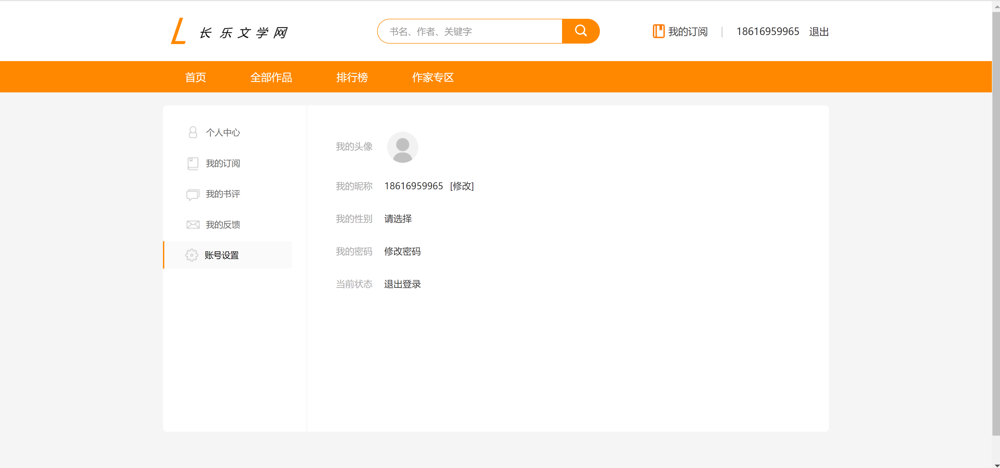

<h1 align="center">长乐文学小说管理系统</h1>

## 简介
长乐文学小说管理系统：角色分为管理员、用户；功能包括小说章节管理、新书发布、用户账户管理、标签编辑、邀请码管理、数据统计、用户注册登录及小说信息展示。    --计算机毕业设计源码；毕设源码；java毕业设计源码

## 联系方式

<h3 align="center">获取完整代码与数据库文件 + 微信：bysj5151 QQ: 86050149 QQ群: 783742310</h3>

<h3 align="center">可帮忙远程部署 包运行成功！提供远程部署、修改代码、设计文档指导、代码讲解等服务！</h3>

## 功能介绍（完整见运行截图）
管理员：  
基本功能：用户登录、身份验证、注册、管理用户信息。  
后台管理：章节管理、新建章节、修改和删除功能，小说基本信息填写、上传封面。  
系统维护：邀请码管理、数据字典管理、标签编辑、系统监控、数据统计与趋势分析。  
用户：  
基本功能：登录、注册、搜索功能，小说阅读和交互。  
小说管理：分类浏览、查看小说信息、阅读章节、订阅和评论。  
个人中心：账号维护、查看和管理订阅内容及个人信息。

## 运行截图

本代码来源于网络,仅供学习参考使用!

